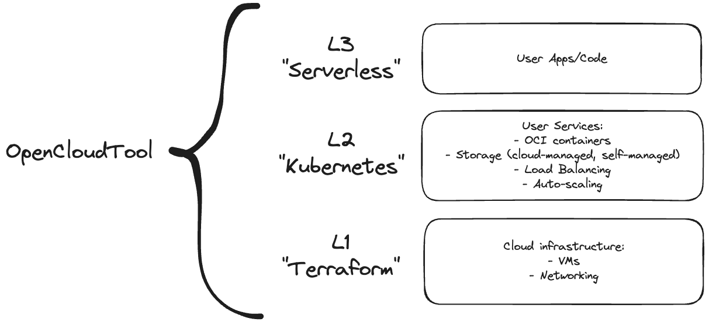

[](https://github.com/21inchLingcod/opencloudtool/actions)
[](https://codecov.io/github/opencloudtool/opencloudtool)

# Open Cloud Tool

A tool to hide the complexity of the cloud

## High Level Design



## Versions Design


## Usage

### Build project

```bash
 cargo build
```

### Run deploy command

```bash
 cd dir/with/oct.toml
 cargo run -p oct-cli deploy
```

### Run destroy command

```bash
 cargo run -p oct-cli destroy
```

### Show all available commands

```bash
 cargo run -p oct-cli --help
```

### Show all available parameters for command

```bash
 cargo run -p oct-cli command --help
```

For example:

```bash
 cargo run -p oct-cli deploy --help
```

## Dev tools

### Machete

Removes unused dependencies

```bash
cargo install cargo-machete
cargo machete
```

### Cargo Features Manager

Removes unused features

```bash
cargo install cargo-features-manager
cargo features prune
```

### Profile building time

Produces HTML file with building time report.
Can be found in `target/cargo-timings.html`

```bash
cargo build -p PACKAGE_NAME --release --timings
```

## Pricing comparison

### Simple REST service

Main components:

- Django REST service (0.5 vCPU, 1GB RAM)
- Celery worker (0.5 vCPU, 1GB RAM)
- Redis (0.5 vCPU, 1GB RAM)
- Postgres (0.5 vCPU, 1GB RAM)
- Load Balancer (nginx, ELB, etc.)

#### AWS ECS Fargate

- 2 vCPU (1 vCPU per hour - $0.04048) - $61.5 per month
- 4 GB RAM (1 GB RAM per hour - $0.004445) - $13.5 per month
- Load Balancer ($0.0225 per hour) - $17 per month

Total: $92 per month

#### OpenCloudTool Pricing with EC2 only

- 1 EC2 [t4g.medium](https://aws.amazon.com/ec2/pricing/on-demand/) instance ($0.0336 per hour): $25.5 per month

Total: $25.5 per month
