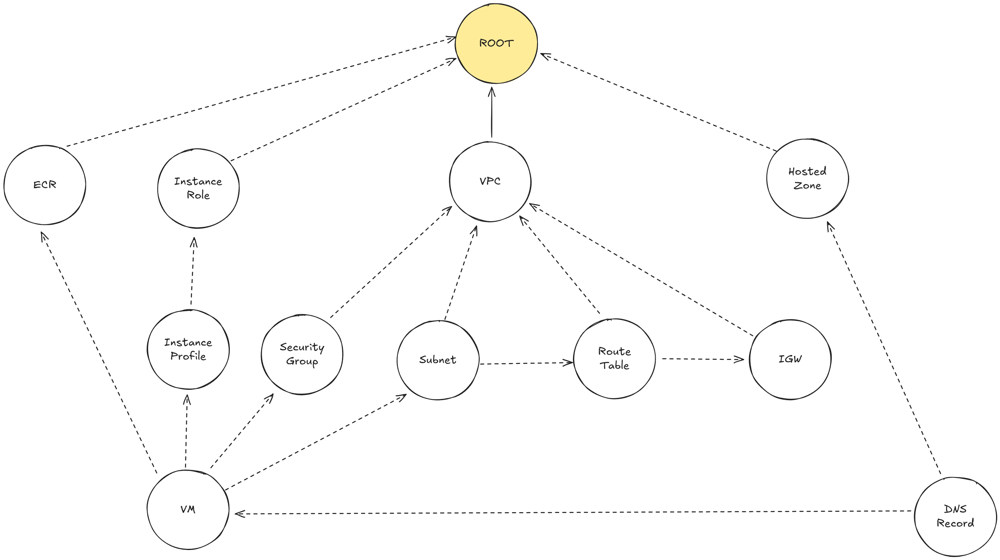

# opencloudtool

[](https://github.com/21inchLingcod/opencloudtool/actions)
[](https://codecov.io/github/opencloudtool/opencloudtool)

A tool to hide the complexity of the cloud.

## Install `oct-cli`

```bash
curl -LsSf https://repo.opencloudtool.com/install.sh | sh
```

or

```bash
wget -qO- https://repo.opencloudtool.com/install.sh | sh
```

## Install as Python library

```bash
pip install opencloudtool
```

See the Python library README for details: [crates/oct-py/README.md](crates/oct-py/README.md)

## Log in to AWS

Basic login ([docs](https://awscli.amazonaws.com/v2/documentation/api/latest/reference/configure/index.html)):

```bash
aws configure
```

Using AWS SSO ([docs](https://awscli.amazonaws.com/v2/documentation/api/latest/reference/configure/sso.html)):

```bash
aws configure sso
```

## Deployment Examples

- [Multiple REST services on the same host with NGINX load balancer](./examples/projects/single-host-rest-service-with-lb/)
- [Multiple REST services on different hosts with NGINX load balancer](./examples/projects/multi-host-rest-service-with-lb/)
- [S3 remote state storage](./examples/projects/s3-remote-state-storage/)
- [REST service with domain](./examples/projects/rest-service-with-domain/)
- [Single host multi services with domains](./examples/projects/single-host-multi-services-with-domains/)
- [Ray single worker](./examples/projects/ray-single-worker/)
- [Inject system env variables](./examples/projects/inject-system-env-var/)
- [HTTP server with single dockerfile](./examples/projects/http-server-with-dockerfile/)
- [HTTP server with multiple dockerfiles](./examples/projects/http-server-with-multiple-dockerfiles/)
- [Dedicated CS2 server](./examples/projects/cs2-server/)
- [FastAPI app via python library](./examples/projects/fastapi-python-sdk/)

## Design

### High-level


### Decentralized `oct`

#### Infrastructure layers


- Base - base cloud resources (networking, VMs, IAM, etc.).
- `oct-ctl`:
  - Consensus - [Raft](https://raft.github.io/)-based consensus mechanism to maintain a distributed state of the infrastructure.
  - Management - management operations to control the infrastructure resources and user services.
  - Service Discovery - DNS service to let the service communicate using domain name and hide the exact IPs.
- Workload - user services deployed along with proxy sidecars to implement service mesh approach.

#### Infrastructure lifecycle


- Genesis - step to setup the initial infrastructure to deploye a leader node that'll control everything.
- Life - the main period of infrastructure lifecycle where the leader is already deployed and all main operations with infrastructure and user services happen.
- Afterlife - the final step of the whole infrastructure destruction.

#### Node


Node can play the following roles:

- Leader - the main node that controls all infrastructure components (follower nodes and underlying infrastructure for them), the user services on the node itself and sends commands to the follower nodes to CRUD user services.
- Follower - the node type that accepts commands from the leader to CRUD user services. The follower node can become a leader if the current leader is not available anymore, according to [the Raft consensus algorithm](https://raft.github.io/).

### User-cloud interaction


### Deployment process

The diagrams try to follow [C4Model notation](https://c4model.com) at component level.

#### L1 infrastructure (cloud resources)

In the current implementation `Infra Graph` is hard-coded.
It'll be updated to be adaptive to the `User Services Graph` at L2.


#### L2 infrastructure (user services)


### Fixed infra graph

Shows the current state of the graph from [crates/oct-cloud/src/infra](./crates/oct-cloud/src/infra/graph.rs).

The diagram can be moved to the infra-specific folder later, keeping it here for now to have all the design documents in one place.



## Development

### Command examples

#### Install pre-commit hooks

```bash
pre-commit install
```

#### Build project

```bash
 cargo build
```

#### Run deploy command

```bash
 cd dir/with/oct.toml
 cargo run -p oct-cli deploy
```

#### Run destroy command

```bash
 cargo run -p oct-cli destroy
```

#### Show all available commands

```bash
 cargo run -p oct-cli --help
```

#### Show all available parameters for command

```bash
 cargo run -p oct-cli command --help
```

For example:

```bash
 cargo run -p oct-cli deploy --help
```

### Writing tests

[WIP] Main principles:

- Each module provides its own mocks in a public `mocks` module

```rust
...main code...

pub mod mocks {
    ...mocks...
}

#[cfg(test)]
mod tests {
    ...tests...
}
```

- Each module tests cover only the functionality in the module
- If a module uses external modules, they are mocked using mocks provided by the imported module's `mocks` module

```rust
...other imports...

#[cfg(test)]
use module::mocks::MockModule as Module;
#[cfg(not(test))]
use module::Module;

...main code...
```

### Imports ordering

When importing modules, the following order should be used:

- Standard library imports
- Third-party imports
- Local crate imports

```rust
use std::fs;

use serde::{Deserialize, Serialize};

use crate::aws::types::InstanceType;
```

## Dev tools

### Machete

Removes unused dependencies

```bash
cargo install cargo-machete
cargo machete
```

### Cargo Features Manager

Removes unused features

```bash
cargo install cargo-features-manager
cargo features prune
```

### Profile building time

Produces HTML file with building time report.
Can be found in `target/cargo-timings.html`

```bash
cargo build -p PACKAGE_NAME --release --timings
```

## Pricing comparison

This section compares the cost of running a set of services in a cloud with different
approaches which do not require the end user to manage underlying infrastructure (serverless).

**Note that OpenCloudTool is a free to use open-source tool and there is no charge for using it.**

### Simple REST service

Main components:

- Django REST service (0.5 vCPU, 1GB RAM)
- Celery worker (0.5 vCPU, 1GB RAM)
- Redis (0.5 vCPU, 1GB RAM)
- Postgres (0.5 vCPU, 1GB RAM)
- Load Balancer (nginx, ELB, etc.)

#### AWS ECS Fargate

- 2 vCPU (1 vCPU per hour - $0.04048) - $61.5 per month
- 4 GB RAM (1 GB RAM per hour - $0.004445) - $13.5 per month
- Load Balancer ($0.0225 per hour) - $17 per month

Total: $92 per month

#### Single EC2 instance managed by OpenCloudTool

- 1 EC2 [t4g.medium](https://aws.amazon.com/ec2/pricing/on-demand/) instance ($0.0336 per hour): $25.5 per month

Total: $25.5 per month

## Repo stats


