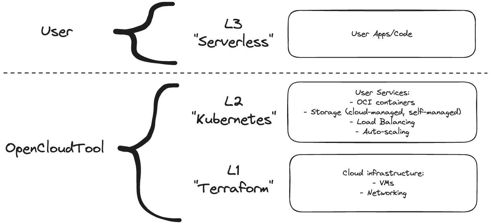
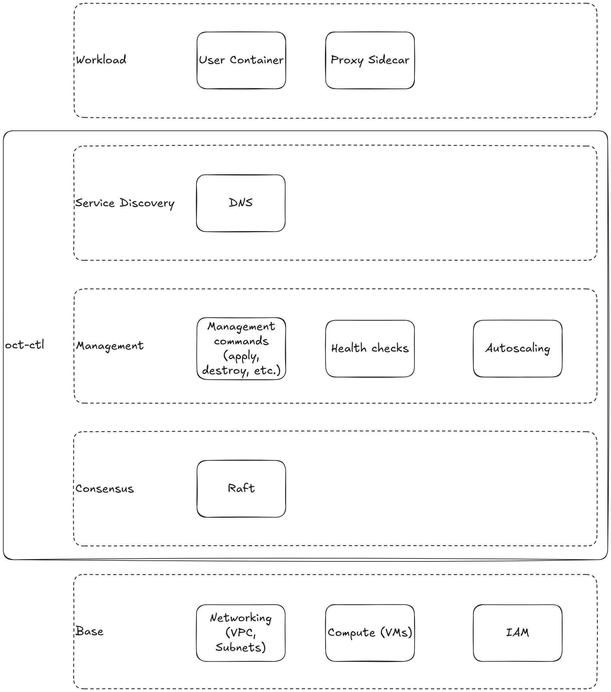
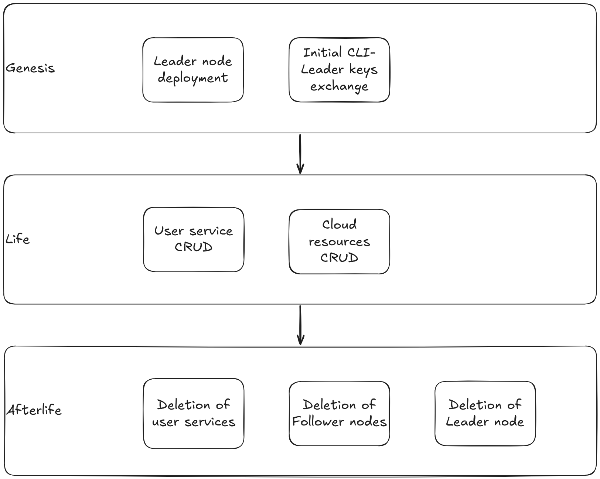
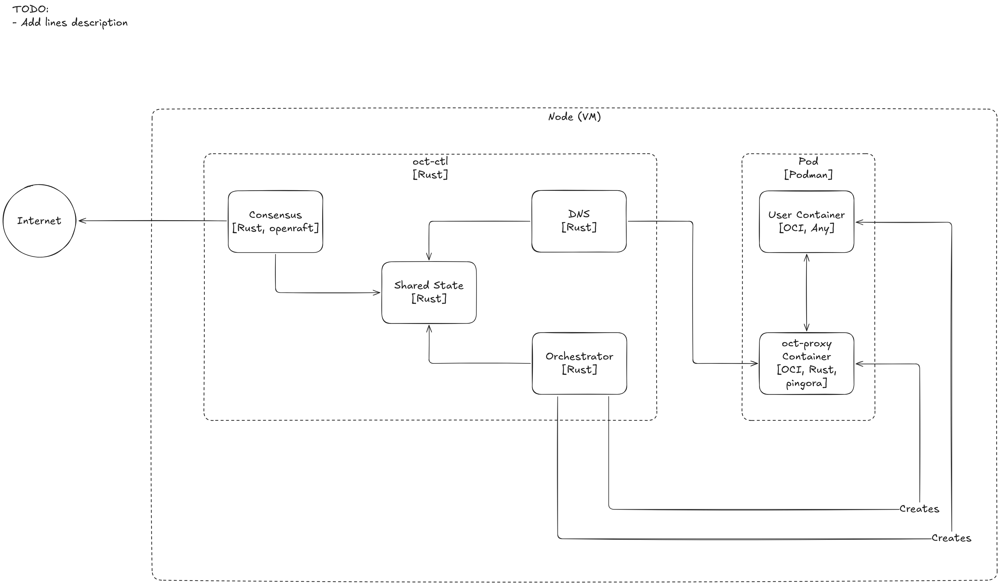
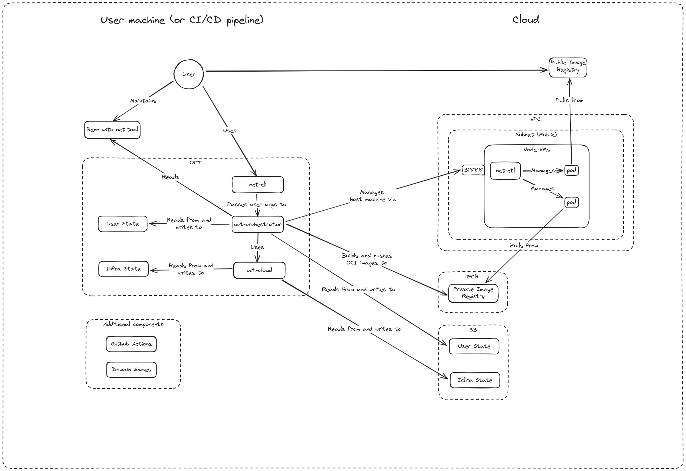
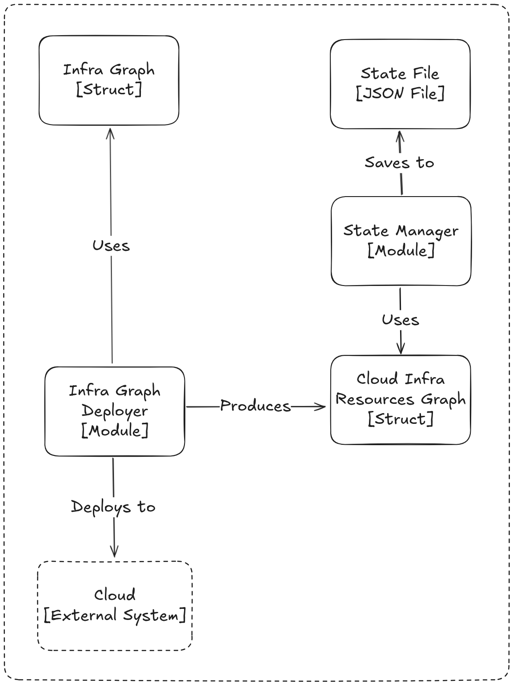
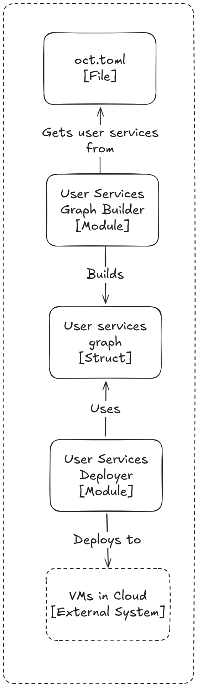
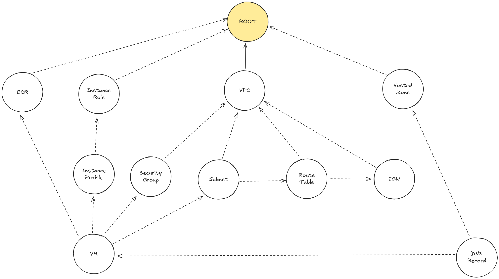

# Design

## High-level

## Decentralized `oct`

### Infrastructure layers

- Base - base cloud resources (networking, VMs, IAM, etc.).
- `oct-ctl`:
  - Consensus - [Raft](https://raft.github.io/)-based consensus mechanism to maintain a distributed state of the infrastructure.
  - Management - management operations to control the infrastructure resources and user services.
  - Service Discovery - DNS service to let the service communicate using domain name and hide the exact IPs.
- Workload - user services deployed along with proxy sidecars to implement service mesh approach.

### Infrastructure lifecycle

- Genesis - step to setup the initial infrastructure to deploy a leader node that'll control everything.
- Life - the main period of infrastructure lifecycle where the leader is already deployed and all main operations with infrastructure and user services happen.
- Afterlife - the final step of the whole infrastructure destruction.

### Node

Node can play the following roles:

- Leader - the main node that controls all infrastructure components (follower nodes and underlying infrastructure for them), the user services on the node itself and sends commands to the follower nodes to CRUD user services.
- Follower - the node type that accepts commands from the leader to CRUD user services. The follower node can become a leader if the current leader is not available anymore, according to [the Raft consensus algorithm](https://raft.github.io/).

## User-cloud interaction

## Deployment process

The diagrams try to follow [C4Model notation](https://c4model.com) at component level.

### L1 infrastructure (cloud resources)

In the current implementation `Infra Graph` is hard-coded.
It'll be updated to be adaptive to the `User Services Graph` at L2.

### L2 infrastructure (user services)

## Fixed infra graph

Shows the current state of the graph from [crates/oct-cloud/src/infra/graph.rs](../../crates/oct-cloud/src/infra/graph.rs).

The diagram can be moved to the infra-specific folder later, keeping it here for now to have all the design documents in one place.

